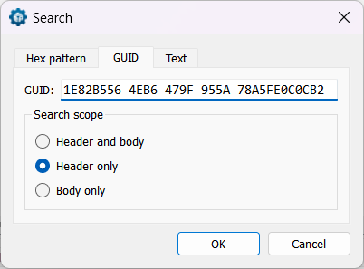
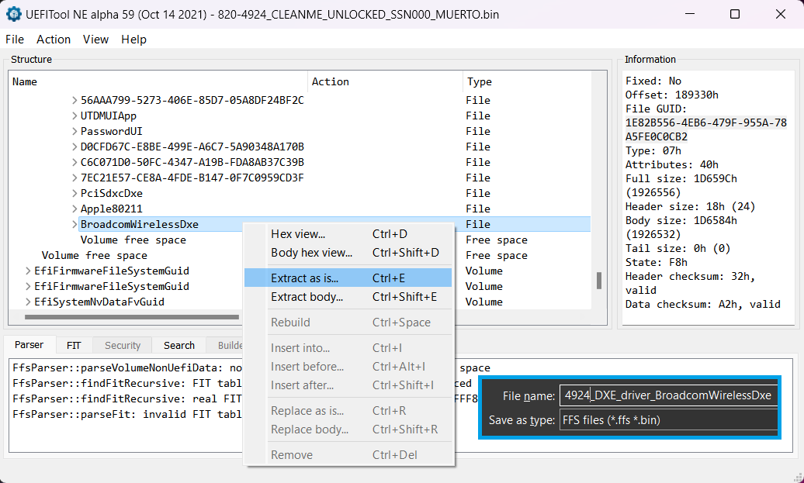
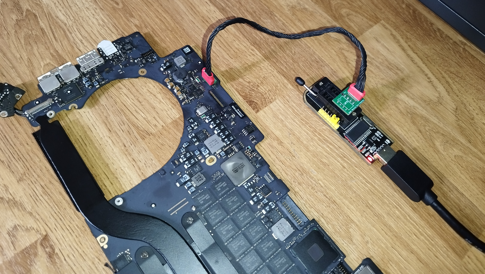
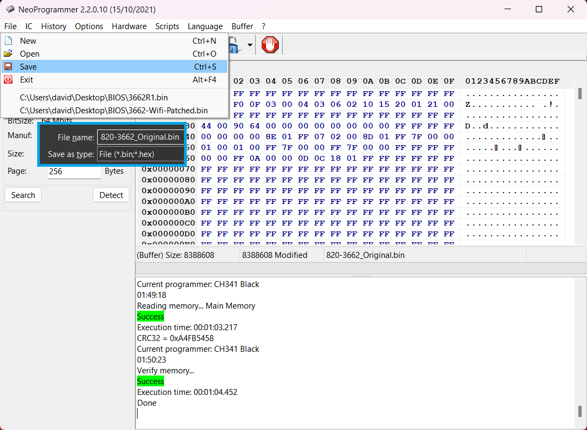
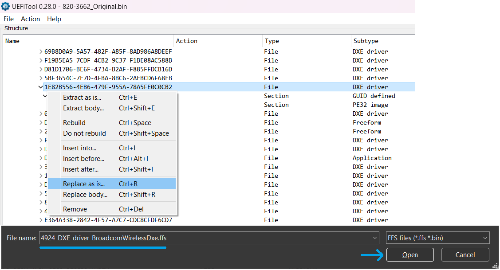
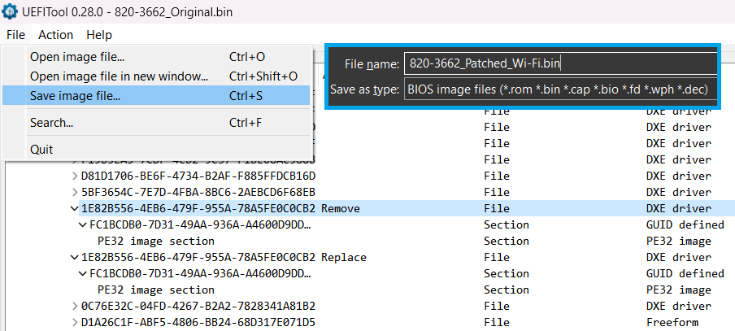
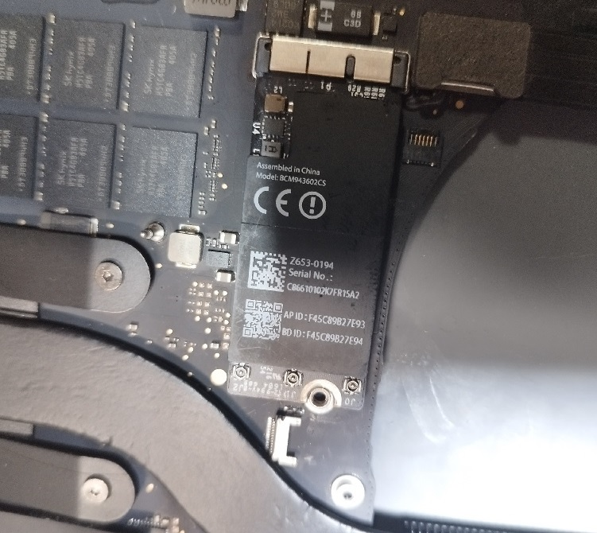
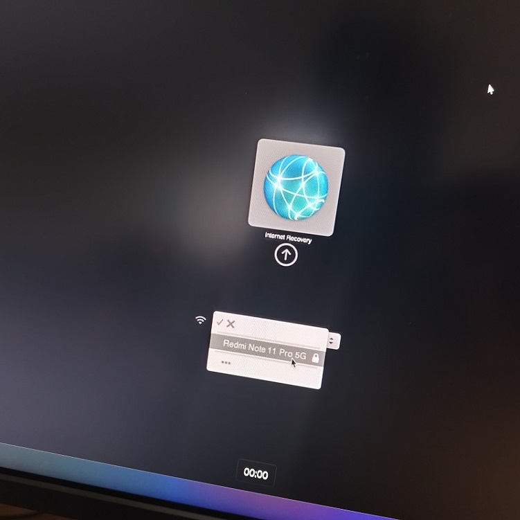

**Intro:**
-
This research exists out of my own curiosity, the info contained was used to make a MacBook Pro 13" 2015 A1502 wireless card compatible with my MacBook Pro 15" 2013 A1398 in recovery mode. A wireless card that isn't designed to be in a specific MacBook will not work in recovery mode, boot menu, etc., as the EFI does not contain a compatible DXE driver, however it will work in MacOS as control is passed over and the Operating System loads its own drivers.

**Limitations:-**
- The machines original wireless card will not work in recovery anymore as we're overwriting the DXE driver.
- If the OS applies a future EFIROM update this modification may be reversed.
- I used wireless cards that were identical in size and vendor (Broadcom).

-----------
**Requirements:**
-
**Hardware:**
- A BIOS Programmer (I used my modded CH341a)
- MacBook Service Port [Programming Cables](https://www.chipsetpro.com/en/efi-rom-hirose-molex-cable/82-spi-sam-efi-rom-debug-connector-flash-service-tool-j6100-icloud-apple-macbook-pr.html)\
`If no service port cables, you'll need to de-solder the SPIROM for reading & programming`
- An A1502 wireless card

**Software:**
- [UEFI Tool](https://github.com/LongSoft/UEFITool) (I used OE, however some images here are NE)
- BIOS Programming Software (I use [AsProgrammer](https://github.com/nofeletru/UsbAsp-flash/releases), or NeoProgrammer for the CH341a)
- An 820-4924 EFIROM dump
- A target EFIROM dump
----------

**Prepare needed DXE driver:**
-
1. Open the A1502 (820-4924) EFIROM in UEFI Tool.
2. Navigate to the wireless driver (BroadcomWirelessDxe), right click and 'Extract as is...'.\
`We can search for the file GUID to find BroadcomWirelessDxe. Action > Search > GUID > {1E82B556-4EB6-479F-955A-78A5FE0C0CB2}`.
2. Save the `.ffs` file for later.

---------
**Dump your EFIROM:**
-
There are plenty of BIOS programming tutorials on the web, I'm not here to teach something that has been documented ten-trillion times.

Using a BIOS programmer, read your original EFIROM, compare what is on the IC to the buffer, then save the buffer into a binary if they match. Always ensure your EFI dumps are not corrupt by comparision, it's preferred not to lose your original data, however not the end of the world.

---------
**Modifying your EFIROM:**
-
1. Open your BIOS dump in UEFI Tool OE
2. Navigate to file GUID `{1E82B556-4EB6-479F-955A-78A5FE0C0CB2}`
3. Right click the DXE driver and select 'Replace as is...'
4. Open the `.ffs` that was saved earlier, this will load in the new driver.
5. Save your new EFI image

---------

**Completion:**
-
Flash back the patched binary with your BIOS programmer and test wireless connectivity, make sure to keep your original dump safe in case you ever require it in the future.

I'll end it here, the pictures speak for themselves. A1502 wireless card working in the A1398 boot menu. Also works perfectly fine in MacOS and internet recovery, etc.

---------

